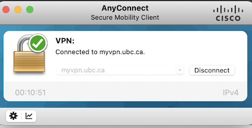
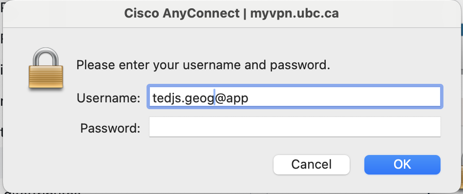
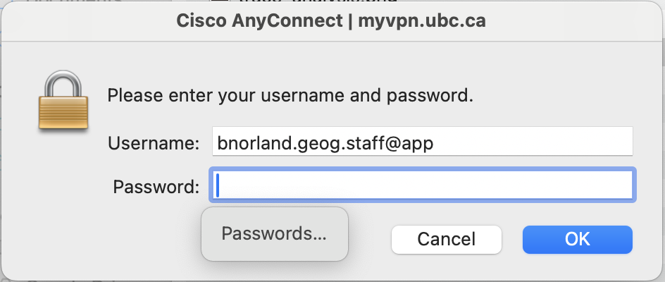
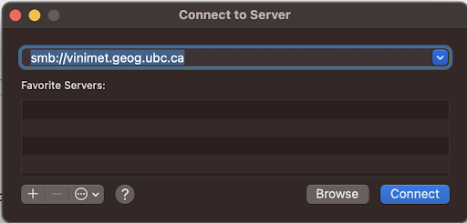
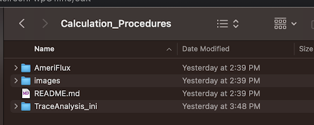
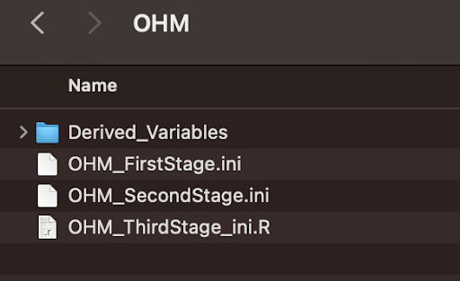
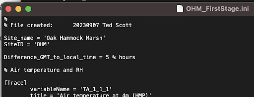
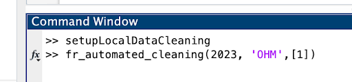

## Steps on MacOS to onboard new site and/or run INI files 
#### *An example with Manitoba site OHM*
___
### How to Connect to **vinimet**


*Note: In January 2024, we learned that some VPN pools have been configured to require MFA for access. The instructions below assume that MFA is required for your VPN pool (after testing with a VPN pool **not** configured to require MFA, these instructions still work but no MFA will be triggered). Additional documentation about accessing VPN pools using MFA can be found [here](https://ubc.service-now.com/kb_view.do?sysparm_article=KB0016157 "How do I connect to VPN with a CWL account protected by MFA?").*


1. Run the [Cisco AnyConnect Client](https://it.ubc.ca/services/email-voice-internet/myvpn "UBC Information Technology myVPN") and connect to the VPN's geog pool. (You should have been notified by the Geography IT team as to which pool you have access to.) To do this, you will still select the basic UBC instance of myVPN: `myvpn.ubc.ca` but instead of just using your &lt;CWL&gt; username, you will include **.geog@app** or **.geog.staff@app** after &lt;CWL&gt; as the username (for app-based MFA; see [link](https://ubc.service-now.com/kb_view.do?sysparm_article=KB0016157 "How do I connect to VPN with a CWL account protected by MFA?") for additional MFA options). That is, you will enter `<CWL>.geog@app` or `<CWL>.geog.staff@app` in the username field and your CWL password in the password field. If MFA has been configured on your VPN pool you will need to authenticate through the app you have configured for your CWL account (or through another MFA authentication method if you choose).








*NOTE: if you get an error here it might be that your VPN access has not yet been granted from the GEOG IT team. Check with them.*


2. From the Finder choose Go | Connect to Server and connect to vinimet
<div align="center">
  <picture>
    
    <figcaption>Connect to server</figcaption>
  </picture>
</div>

##### Use the username and password from the 'Access to Servers and Remote Desktop' doc on the Micromet site, and choose “Projects” for the volume to mount

<br>

##### [NOTE: If you have already created directories and are just wanting to process data locally and/or make changes to the existing INI files you can skip to “Generate some processed data…” below]

<br><br>

### Now you can create the directory structure as recommended if you haven’t yet
<br><br>

1. Create /local_data_cleaning somewhere that is on the path you have set in Matlab (you did part of this while you followed the instructions from the [UBC PC Setup Repository](https://github.com/ubc-micromet/UBC_PC_Setup-template)),<br> e.g. **/Users/tedscott/Matlab/local_data_cleaning/**
- Ask around: there may be some advantage to putting this on a cloud drive for ease of access and backup?

2. Create subfolders 
1. For the Databases e.g., **./Database**
2. For your site, e.g., **./OHM**

<br><br>

### Clone the Calculation_Procedures repo from micromet

<br><br>

1. Go to the [Calculation_Procedures](https://github.com/ubc-micromet/Calculation_Procedures) repo on the micromet github site and under the green “Code” button copy the URL 

2. In a terminal window, cd to your Database folder and run 
  ```
         git clone <URL you just copied>
  ```

3. Verify you now have the subfolders

<div align="center">
  <picture>
    
    <figcaption>Directory of Calculation_Procedures</figcaption>
  </picture>
</div>

<br><br>

### Create the Local Copy of the Database

<br><br>

1. Boot MATLAB if you haven’t yet

2. Navigate to your site-specific folder, e.g., **./local_data_cleaning/OHM **

3. Run Zoran’s app **setupLocalDataCleaning** from the MATLAB prompt

<div align="center">
  <picture>
    
    <figcaption>running setupLocalDataCleaning in MATLAB</figcaption>
  </picture>   
</div>

4. Fill in the fields as above for your specific site paths, year/s of interest [e.g., 2021:2023], and then click “Copy Database”

5. Click OK on the first prompt about cloning Calculation_Procedures because you already did it, then wait for the copying to finish and report success. This could take some time especially for the first ever copy. Should be very quick if copying a year for which you have most or all of the latest data.

6. Verify that in your Database folder you now have a subfolder with the year you specified and that inside that year folder there is a folder that has your site name. Inside that folder there should be a Flux folder with content (hooray) and other folders depending on the site’s *instrumentation and setup* may exist but could be empty as you haven’t yet run any INI files to process the raw data.

<br><br>

### Generate some processed data - run an INI file or more

<br><br>

1. Navigate to your **Database/Calculation_Procedures/TraceAnalysis_ini ** folder

2. For OHM, I (with the help of Zoran), I had to create a subfolder called OHM and then I copied the contents of the YOUNG folder in the TraceAnalysis_ini folder (currently 3 script files and a folder called Derived_Variables), which I renamed with OHM as these did not yet exist

<div align="center">
  <picture>
    
    <figcaption>Directory of Trace_Analysis</figcaption>
  </picture> 
</div>

3. Open the *_FirstStage.ini file for editing using your favorite text editor on Mac (e.g. VS Code)

4. In my case, I needed to update the first four lines from what was in the YOUNG_FirstStage.ini and also made some OHM-specific path changes for some of the variables. Here are the first few lines of my new **OHM_FirstStage.ini** file

<div align="center">
  <picture>
    
    <figcaption>First few lines of OHM_FirstStage.ini</figcaption>
  </picture>   
</div>

5. Assuming the file is ready to go, in MATLAB you are now ready to run one or more of the stage INI files using **fr_automated_cleaning()**

<div align="center">
  <picture>
    
    <figcaption>Running fr_automated_cleaning in MATLAB</figcaption>
  </picture> 
</div>

**The arguments shown above let you specify a year or range of years  [example 2020:2023 instead of 2023], a site or list of sites, and a list of stages to run. In my case, I only have the OHM_FirstStage.ini built so it only has a 1, but you could have 1,2,3 if all three stages’ scripts are functional. See the README at [https://github.com/ubc-micromet/Calculation_Procedures](https://github.com/ubc-micromet/Calculation_Procedures) for caveats especially for your Third Stage scripts. ** 


6. If it runs successfully, you will see something like the following in MATLAB

<div align="center">
  <picture>
    
    <figcaption>Output from fr_automated_cleaning in MATLAB. If you get errors, be sure to check all your paths in your INI</figcaption>
  </picture>     
</div>


7. Now you can navigate to the expected output paths and see the results. For example, running the line above deleted and then updated the contents of <br>  `/Users/tedscott/Matlab/local_data_cleaning/Database/2023/OHM/Flux/Clean`

<br><br>

##### Now you can run and update INI files for your sites! However, remember that the changes you have made are local to your “sandbox” of the data and scripts. Once you have changes that are of good quality and provide meaning, you should get your updates reviewed and pulled to the Calculation_Procedures repo so that everyone benefits and so that your changes are not lost once you move on to future work.**

<br><br>

###### *Author: Ted Scott*
###### *Last Updated: 2024-01-16 by Bree Norlander*
